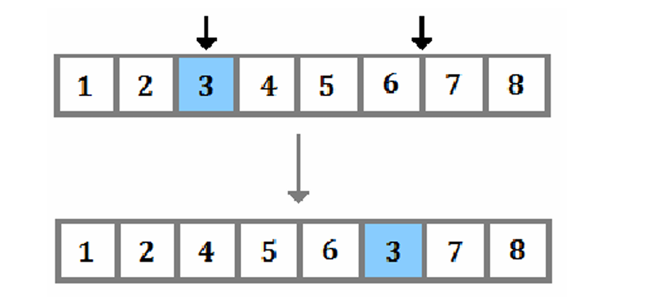

# Job Shop Scheduling using Genetic Algorithm

This project implements a job shop scheduling solution using a genetic algorithm. The solution optimizes the scheduling of jobs across multiple machines to minimize the total completion time (makespan).

## Problem Formulation

### Fitness

Fitness Functions in genetic algorithms represent the evaluation metric that drives the
accuracy of the genetic algorithm to the optimal solution. In the case of the job shop scheduling
problem, the aim is to minimze the time it takes to finish all operations. This value is called
makespan and it is calculated by taking the maximum finish time of all operations in a
chromosome. Since a lower makespan means a better solution, the fitness function is chosen to be
the reciprocal of the makespan. This fitness function is also used when selecting the parents in the
crossover operation

### Chromosome Representation

A chromosome in the job shop scheduling problem is an array of integers representing a
schedule of the jobs as a sequence of operations where the occurrence number of each job in the
chromosome reflects the operation number of a particular job. For instance,the following
chromosome represents a schedule of 4 jobs : [1, 1, 2, 3, 4, 2, 4, 2] ,where Job 1 is comprised of 2
operations, Job 2 of 3 operations and so on.

### Initial Population

The initial population is generated by taking the number of jobs and machines to
randomly generate an initial chromosome. To create the initial population, the initial chromosome
is then shuffled randomly multiple times.

### Crossover

 Crossover is a genetic operator that combines features of two selected chromosomes with
 the aim of producing an offspring that represents a better solution. There are various types of
 crossover techniques that are used in genetic algorithms, this project uses Partially Mapped
 Crossover (PMX). The main advantage of PMX is that it preserves the arrangement of some of
 the genes while allowing for some variation. PMX is implemented by selecting two random cut
 off points that divide the parents’ chromosomes into three segments. After that, the middle part is
 copied from one parent to another. Finally, a mapping relationship is established to preserve the
 number of operations for each job and avoid gene redundancy.

 <p align="center">
    
 </p

### <h3>Mutation</h3>

 The aim of this operation is to introduce a small change in a selected chromosome in
 order to bring in diversity to the genetic population and produce a better solution. Like the
 crossover operation, there are many types of mutation operators. The mutation type used in this
 project is the insertion mutation. It randomly selects 2 genes, and then changes the position of
 of the first randomly selected gene to be an index before the second chosen gene. Thus shifting
 all the genes in the chromosome.

<p align="center">
  
</p>

## Project Structure

The project consists of the following files:

- **Driver.py**: Contains the main function and the genetic algorithm operations such as mutation, crossover, and initial population generation.
- **Individual.py**: Defines the `Individual` class with methods for each individual, including fitness calculation.
- **Job.py**: Defines the `Job` class with attributes and methods for each job.
- **Machine.py**: Defines the `Machine` class with attributes and methods for each machine.

## Input Format

The input is provided as a CSV file named `test.csv` with the following format:

```csv
job_id,operation,machine,duration
n1,n2,n3,n4
...
```

- `job_id`: Identifier for the job.
- `operation`: Operation number for the job.
- `machine`: Machine assigned to the operation.
- `duration`: Duration of the operation on the machine.

Each row represents a specific operation on a machine, and each column represents a specific attribute of the operation.

## Dependencies
- Python 3.x
- pandas (for reading CSV files)
- numpy (for numerical operations)

You can install the required packages using pip:
``` bash
pip install pandas numpy
```

## Usage
1. Ensure you have test.csv in the same directory as the script, formatted as described in the Input Format section.
2. Run the main script Driver.py:

## Example
Here is an example test.csv file:

| job_id | operation | machine | duration |
|--------|-----------|---------|----------|
| 1      | 1         | 1       | 5        |
| 1      | 2         | 2       | 3        |
| 2      | 1         | 1       | 2        |
| 2      | 2         | 2       | 4        |

This input specifies:

- Job 1, Operation 1, on Machine 1, with a duration of 5 units.
- Job 1, Operation 2, on Machine 2, with a duration of 3 units.
- Job 2, Operation 1, on Machine 1, with a duration of 2 units.
- Job 2, Operation 2, on Machine 2, with a duration of 4 units.

## How it works

1. Read Input: The script reads the input parameters from test.csv.
2. Generate Initial Population: An initial population of schedules is generated.
3. Evaluate Fitness: Each schedule (individual) is evaluated for its fitness.
4. Selection: Individuals are selected based on their fitness.
5. Crossover: Pairs of individuals are combined to produce offspring.
6. Mutation: Random variations are introduced into the population.
7. Repeat: The process is repeated for a number of generations or until a termination condition is met.
8. Output: The best schedule found is output as a gantt chart, showing the optimized job schedule across machines.

## Output Format

The output of the job shop scheduling using the genetic algorithm is presented as a Gantt chart. A Gantt chart is a type of bar chart that illustrates a project schedule, showing the start and finish times of different operations on various machines.

### Gantt Chart

The Gantt chart displays each job's operations as horizontal bars, with the length of each bar representing the duration of the operation. The chart provides a visual representation of the schedule, allowing you to see how operations are distributed across machines and their respective start and finish times.

The x-axis typically represents time, while the y-axis lists the machines. Each bar in the chart corresponds to a specific operation of a job, and the position of the bar on the y-axis indicates the machine on which the operation is performed. The color of the bars can be used to differentiate between different jobs or operations.

The Gantt chart provides a comprehensive overview of the job shop scheduling solution, making it easy to analyze and understand the schedule's efficiency and utilization of resources.

## Example Output

below is an example output given for this input test case
| job_id | operation | machine | duration |
|--------|-----------|---------|----------|
| 1      | 1         | 3       | 8        |
| 1      | 2         | 7       | 4        |
| 1      | 3         | 1       | 2        |
| 1      | 4         | 8       | 6        |
| 1      | 5         | 5       | 7        |
| 2      | 1         | 0       | 3        |
| 2      | 2         | 6       | 6        |
| 2      | 3         | 2       | 5        |
| 2      | 4         | 9       | 2        |
| 2      | 5         | 1       | 4        |
| 3      | 1         | 4       | 7        |
| 3      | 2         | 2       | 3        |
| 3      | 3         | 8       | 9        |
| 3      | 4         | 5       | 4        |
| 3      | 5         | 7       | 8        |
| 4      | 1         | 6       | 4        |
| 4      | 2         | 1       | 5        |
| 4      | 3         | 3       | 5        |
| 4      | 4         | 9       | 4        |
| 4      | 5         | 2       | 3        |
| 5      | 1         | 0       | 3        |
| 5      | 2         | 7       | 6        |
| 5      | 3         | 1       | 7        |
| 5      | 4         | 4       | 4        |
| 5      | 5         | 9       | 5        |
| 6      | 1         | 2       | 5        |
| 6      | 2         | 3       | 8        |
| 6      | 3         | 6       | 6        |
| 6      | 4         | 0       | 7        |
| 6      | 5         | 8       | 4        |
| 7      | 1         | 4       | 5        |
| 7      | 2         | 9       | 4        |
| 7      | 3         | 2       | 3        |
| 7      | 4         | 1       | 7        |
| 7      | 5         | 6       | 5        |
| 8      | 1         | 5       | 6        |
| 8      | 2         | 3       | 8        |
| 8      | 3         | 0       | 4        |
| 8      | 4         | 7       | 7        |
| 8      | 5         | 1       | 6        |
| 9      | 1         | 9       | 3        |
| 9      | 2         | 8       | 5        |
| 9      | 3         | 6       | 7        |
| 9      | 4         | 3       | 4        |
| 9      | 5         | 0       | 8        |
| 10     | 1         | 1       | 7        |
| 10     | 2         | 5       | 6        |
| 10     | 3         | 2       | 3        |
| 10     | 4         | 4       | 5        |
| 10     | 5         | 7       | 8        |
| 11     | 1         | 3       | 6        |
| 11     | 2         | 9       | 4        |
| 11     | 3         | 5       | 3        |
| 11     | 4         | 0       | 7        |
| 11     | 5         | 8       | 5        |
| 12     | 1         | 2       | 6        |
| 12     | 2         | 7       | 3        |
| 12     | 3         | 1       | 4        |
| 12     | 4         | 4       | 7        |
| 12     | 5         | 6       | 8        |
| 13     | 1         | 0       | 5        |
| 13     | 2         | 5       | 6        |
| 13     | 3         | 3       | 7        |
| 13     | 4         | 8       | 4        |
| 13     | 5         | 9       | 2        |
| 14     | 1         | 6       | 3        |
| 14     | 2         | 2       | 7        |
| 14     | 3         | 4       | 6        |
| 14     | 4         | 7       | 5        |
| 14     | 5         | 1       | 8        |
| 15     | 1         | 3       | 6        |
| 15     | 2         | 9       | 5        |
| 15     | 3         | 6       | 7        |
| 15     | 4         | 8       | 4        |
| 15     | 5         | 0       | 3        |
| 16     | 1         | 5       | 7        |
| 16     | 2         | 2       | 4        |
| 16     | 3         | 1       | 3        |
| 16     | 4         | 7       | 5        |
| 16     | 5         | 9       | 6        |
| 17     | 1         | 4       | 8        |
| 17     | 2         | 3       | 6        |
| 17     | 3         | 6       | 5        |
| 17     | 4         | 0       | 7        |
| 17     | 5         | 8       | 3        |
| 18     | 1         | 2       | 5        |
| 18     | 2         | 9       | 4        |
| 18     | 3         | 5       | 7        |
| 18     | 4         | 7       | 6        |
| 18     | 5         | 1       | 8        |
| 19     | 1         | 4       | 7        |
| 19     | 2         | 3       | 6        |
| 19     | 3         | 0       | 5        |
| 19     | 4         | 6       | 4        |
| 19     | 5         | 8       | 3        |
| 20     | 1         | 7       | 8        |
| 20     | 2         | 1       | 6        |
| 20     | 3         | 9       | 5        |
| 20     | 4         | 2       | 7        |
| 20     | 5         | 4       | 4        |


output : 
<p align="center">
  
</p>

## Contributors
- [Yazan AbuAloun](https://github.com/yazan6546)
- [Ahmad Qaimari](https://github.com/ahmadqaimari)
